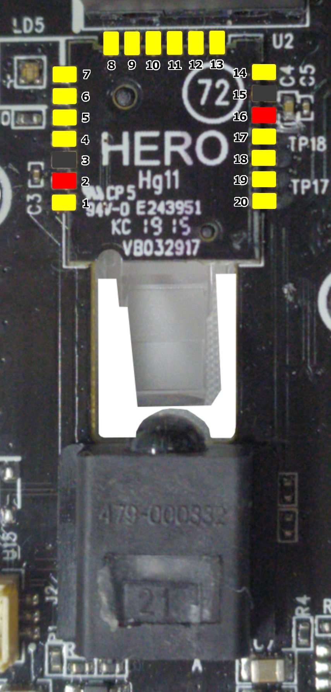

# hero-re

Reverse engineering of the HERO sensor used by Logitech mice

The Hero is a sensor developed in house by Logitech, it's a follow up to the mercury sensor.

## Pin Configuration

Pin no. | Funcion | Type | Description
:---: | :---: | :---: | :---:
1 | GND | ? |
2 | VDD | Power | Sensor power input
3 | GND | Power |
4 | GND | ? |
5 | IR LED K | LED drive | IR LED Cathode
6 | GND | ? |
7 | NC | NC |
8 | GND | ? |
9 | NC | NC |
10 | GND | ? |
11 | NC | NC |
12 | GND | ? |
13 | NC | NC |
14 | NC | NC |
15 | GND | Power |
16 | DEC | Power | External decoupling for internal 1.7V
17 | SCLK | SPI |
18 | MISO | SPI | also used as motion/wake up pin
19 | MOSI | SPI |
20 | CS | SPI |

## Interface

The Hero sensor uses Serial Peripheral Interface (SPI) as a comunications layer

Chip Select is active low

It uses CPOL = 1, CPHA =  1, aka MODE = 3

Parameter | Value | Unit
:---: | :---: | :---:
Clock Frequency | 4.0 | MHz

Read and write operations are determined by bit 8, the following 7 bits provide the address of the opperation

 Value | Operation
:---: | :---:
1 | Read
0 | Write

The following 8 bits are data, either from the host in a write, or to the host in a read

In a read, during the data phase, another address can be sent with the read bit set, allowing consecutive reads

Consecutive writes are apparently allowed

## Registers

address | Function | Values | Default | Info
:---: | :---: | :---: | :---: | :---:
0x00 | ? |  |   | Status or flag register?
0x03 | ? |  | 0x20 usually, switches between 0x30 and 0x20 in sleep, 0x28 in deep sleep | when 0x28, rest mode is active after ~1 second inactivity, irrespective of reg 0x22 and has frame period 8 times greater than specified in reg 0x21.
0x05 | delta y high |  |  | signed 16 bit, 2's complement, top 8
0x06 | delta y low |  |  | signed 16 bit, 2's complement, bot 8
0x07 | delta x high |  |  | signed 16 bit, 2's complement, top 8
0x08 | delta x low |  |  | signed 16 bit, 2's complement, bot 8
0x0C | y DPI | DPI = (value + 1) * 50 |  | 0x00 - 0xFF (50 - 12800 DPI)
0x0D | x DPI | DPI = (value + 1) * 50 |  | 0x00 - 0xFF (50 - 12800 DPI)
0x16 | ? |  |  | seems to be related to surface
0x20 | maximum frame period (run) | period = 20us * value, floor of 100us | 0x32 = 50 (1000 fps) | when in motion, frame period may be lower than this value. in other words, framerate increases when in motion. if value <= 5, tracking at slow speeds suffers. no obvious difference in slow speed tracking quality for value >= 6.
0x21 | frame period (rest) | period = 80us * value | ? |
0x22 | run-to-rest timeout | (0.5 * value + 1) seconds | 0xc8 = 200 |

## SROM

the hero sensor needs firmware to be uploaded to it at startup, we call this SROM

srom "extraction" tools are available in [tools](tools/)

ready to use blobs are available in this repo [openinput-fw/sensor-blobs](https://github.com/openinput-fw/sensor-blobs)

## Sensor "overclocking"

by default the hero sensor in the g305 is configured to run at roughly 1000 frames/s, and scales up to 12000 frames/s depending on the motion speed.

apparently, register 0x20 controls the maximum frame period (and hence, the minimum framerate) and can be set such that the minimum framerate is slightly above 8000 frames/s.

## Example Driver

Even though the sensor is not thoroughly documented, we have a working proof of concept [driver](https://github.com/qsxcv/q305/blob/main/mouse/hero.h)
